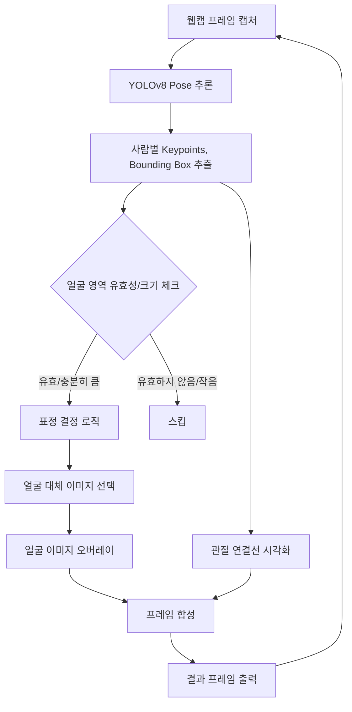

# Emoticon Project 전체 처리 흐름도 (Mermaid)

- **A**: 웹캠에서 프레임을 읽어옴
- **B**: YOLOv8 pose 모델로 사람/관절 추론
- **C**: 각 사람의 keypoints, bounding box 추출
- **D**: 얼굴 keypoint가 프레임 내에 있고, 얼굴 영역이 충분히 큰지 체크
- **E**: 손 위치, palm 방향, 움직임 등으로 표정 결정
- **F**: 결정된 표정에 맞는 얼굴 이미지 선택
- **G**: 얼굴 영역에 이미지 오버레이
- **H**: skeleton(관절 연결선) 시각화
- **I**: 오버레이/스켈레톤이 적용된 프레임 합성
- **J**: 결과 프레임을 화면에 출력
- **K**: 얼굴 영역이 작거나 유효하지 않으면 해당 사람은 스킵
